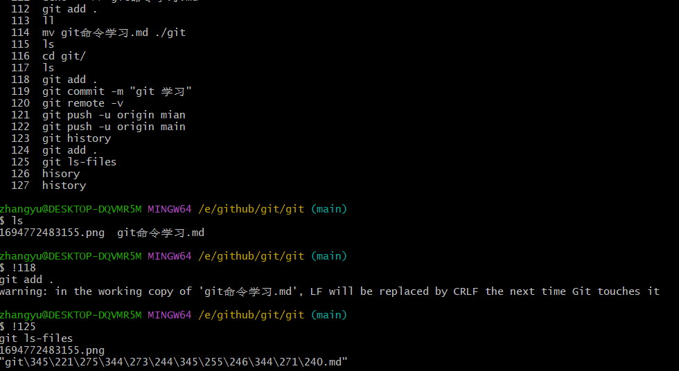

1. $git$ ：$git$ 是一个开源的分布式版本控制系统，也是计算机专业找工作的必备技能之一，其最初由 $linux$ 之父创造，于 $2005 $ 年发布；

2. 新建项目的时候 $github$ 提示的一些命令：

   ```bash
   echo "# git" >> README.md # 将# git写入到README.md文件；
   git init # 将当前目录初始化为git仓库
   git add README.md # 将README.md文件添加到暂存区
   git commit -m "first commit" # 将文件提交到本地仓库中（.git隐藏文件中）
   git branch -M main 
   git remote add origin git@github.com:hytirrbaixi/git.git # 将本地仓库和远程仓库相关联
   git push -u origin main # 将本地仓库的内容推送到远程仓库
   ```

3. $github$ 上配置了 $ssh$ 那么使用 $git \ clone$ 命令不仅可以克隆自己的项目，而且还可以克隆别人的项目；

4. 每一个仓库项目对应的别名默认是 $origin$，我们可以指定对应的别名，一般克隆项目到本地的别名都是 $origin$；可以使用 $git \ remote -v$ 命令查看远程仓库对应的别名；

5. $git \ ls-files$ 用来查看暂存区的内容（也是查看已经使用 $git \ add$ 命令添加到暂存区的文件）：

    

6. 使用 $history$ 命令用来查看执行命令的历史情况；并且可以结合查看历史命令再次执行对应编号的命令，可以使用感叹号加上对应的命令编号执行命令，例如： !118，118为对应的命令编号，不过有的时候使用 $history$ 命令显示太长了，那么可以使用：history | tail 命令，一般 $tail$ 命令会显示末尾 $10$ 行，我们可以设置显示的行数，例如：history | tail -20；其中 $20$ 就是末尾的 $20$ 行：

   

     

7. $tail$ 命令：tail -n 20 notes.log；表示显示 $notes.log$ 末尾 $20$ 条的内容；

8. 
